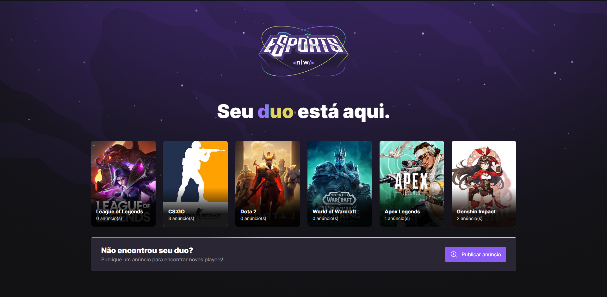
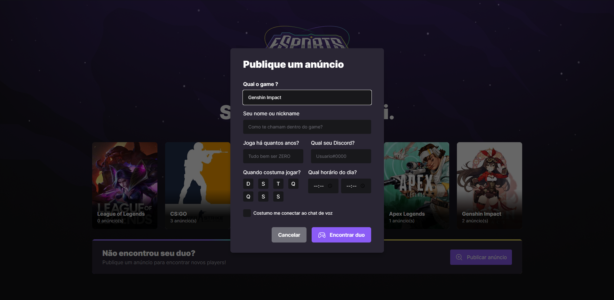
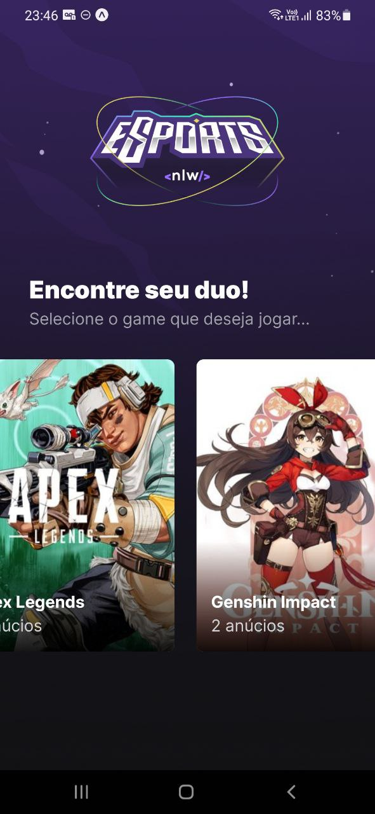
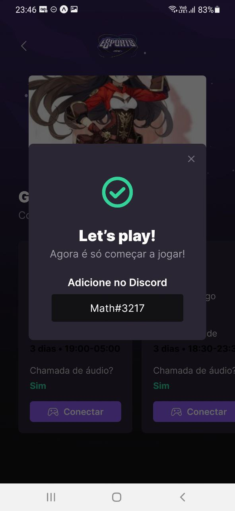

# Sobre
Esse é um projeto realizado no evento da rocketseat nlw eSports.
O projeto tem as tecnologias usadas React, TypeScript, Nodejs e React Native

## Projeto - web
No projeto web foi usado React + TypeScript + Tailwindcss

  
  

## Projeto - mobile
No projeto mobile foi usado ReactNative + TypeScript

  
  

## Projeto - back end
No Server da aplicação teve as tecnolgias Nodejs + TypeScript + Prisma